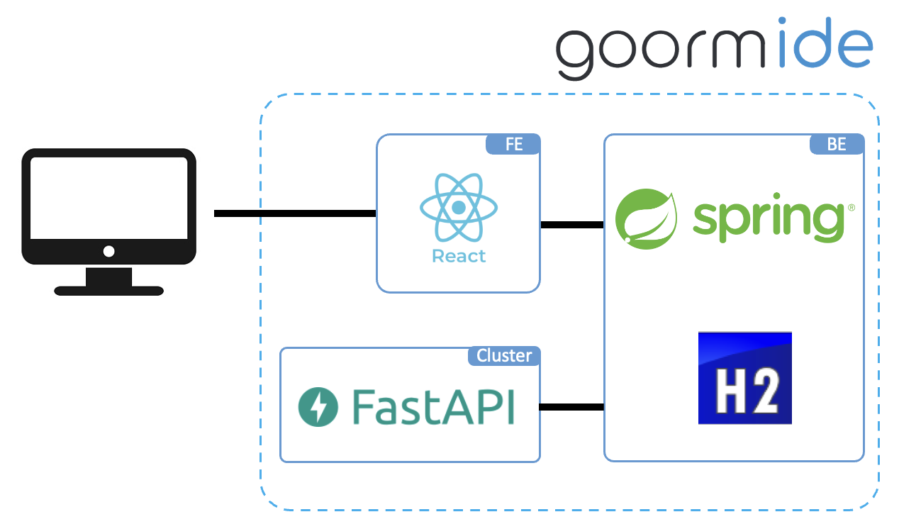

# hello-kicktty-BE

> 팀 헬로킥티

### 공유 킥보드의 군집화를 유도하는 실시간 주차 구역 제안 서비스

## 서비스 아키텍처



## API 명세서

### 클라이언트 → 웹 서버

1. 킥보드 리스트 조회

   - Method: `GET`
   - End Point: `/kickboards`
   - Query: `lat=float`, `lng=float`
   - RequestBody:
   - ResponseBody:
     ```json
      {
       "distance":float,
       "clusters":[
           {
             "cluster_id":int,
             "distance":float,
             "center":{"lat":float, "lng":float},
             "borders": [
               {
                 "border_id":int,
                 "lat":float,
                 "lng":float
               },
               // …
             ]
           },
           // …
         ],
       "kickboards":[
           {
             "id":int,
             "lat":float,
             "lng":float,
             "cluster_id":int,
             "danger":bool,
             "border":int
           },
           // …
         ]
      }
     ```
   - 비고:쿼리 넣지 않으면 전체 킥보드 리스트 출력

2. 단일 킥보드 정보 조회
   - Method: `GET`
   - End Point: `/kickboards/{:id}`
   - RequestBody:
   - ResponseBody:
     ```json
     {
       "id":int,
       "lat":double,
       "lng":double,
       "cluster_id":int,
       "danger":bool,
       "border":int
     }
     ```
   - 비고
3. 킥보드 주차
   - Method: `POST`
   - End Point: `/kickboards`
   - RequestBody:
     ```json
     {
       "id":int,
       "lat":double,
       "lng":double
     }
     ```
   - ResponseBody:
     ```text
       "id":int
     ```
   - 비고: res body id = kickboard id, 값이 0이면 실패
4. 킥보드 대여

   - Method: `DELETE`
   - End Point: `/kickboards/{:id}`
   - RequestBody:
   - ResponseBody:
   - 비고: res body id = kickboard id, 값이 0이면 실패

5. 견인 서비스 이름 호출

   - Method: `GET`
   - End Point: `/namespace`
   - RequestBody:
   - ResponseBody:
     ```json
     {
     "kickboards": [
       {
           "id":int,
           "name":string,
           "center":{"lat":float, "lng":float},
         },
        // …
     ],
     "clusters":[
         {
           "id":int,
           "name":string,
           "center":{"lat":float, "lng":float},
           },
        // …
       ]
     }
     ```
   - 비고: center 좌표의 도로명주소 API 문자열 반환, 미리 이름을 전부 받아와 성능 개선

6. 킥보드 근처 군집 추천
   - Method: `GET`
   - End Point: `/recommend`
   - Query: `id=int`
   - RequestBody:
   - ResponseBody:
     ```json
      {
       "my_id": int,
       "clusters":[
           {
             "cluster_id":int,
             "distance":float,
             "center":{"lat":float, "lng":float},
             "borders": [
               {
                 "border_id":int,
                 "lat":float,
                 "lng":float
                },
               // …
             ]
           },
           // …
         ]
       }
     ```
   - 비고

### AI 서버 → 웹 서버

1. 킥보드 정보 갱신

   - Method: `POST`
   - End Point: `/update`
   - RequestBody:

   ```json
   [
     {
       "id":int,
       "lat":float,
       "lng":float,
       "cluster_id":int,
       "danger":bool,
       "border":int
     },
   // …
   ]
   ```

   - ResponseBody:
   - 비고: List\<Kickboard\>를 보내는 구조
